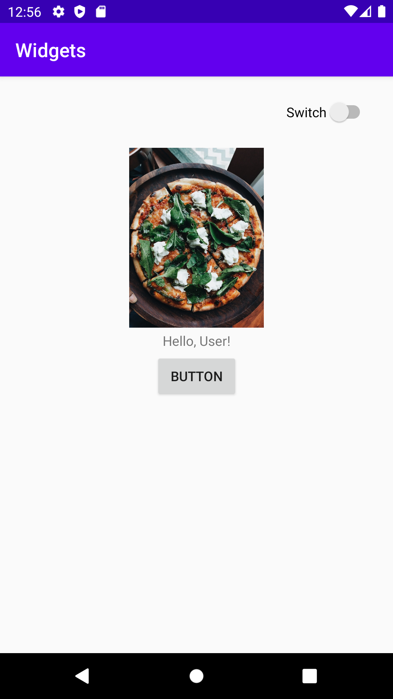

# Rapport

Till detta projekt valde jag att använda mig av en Constrain Layout för att lösa uppgiften. Uppgiftslösningen består utav fyra
stycken widgets, varav tre stycken är implementerat av mig. De tre widgets som har använts har varit 
Button, ImageView och Switch.

Det första som implementerades för appen var en button. Denna Button positionerades först relativt till sin förälder, eftersom
inga andra widgets ännu skapats i detta steg, och jag (längre fram) har valt att positionera alla mina widgets relativt till varandra.
Längre fram positionerades denna Buttom om iallafall, och förhåller sin referens position "TOP" till widgeten "Switch" "Top" position,
medans knappen fortfarande förhåller sin botten, vänster och höger position till parent.

### Kod för Widget: Button
```
<Button
        android:id="@+id/button"
        android:layout_width="wrap_content"
        android:layout_height="wrap_content"
        android:text="Button"
        app:layout_constraintBottom_toBottomOf="parent"
        app:layout_constraintLeft_toLeftOf="parent"
        app:layout_constraintRight_toRightOf="parent"
        app:layout_constraintTop_toTopOf="@id/switch1" />
```

Därefter skapade jag en ImageView widget som innehåller en bild på en pizza i detta fall. Tänken med bilden är att det skulle kunna vara användarens
profil bild i ett verkligt scenario. Denna widget positioneras sig på följande sätt: Toppen - toppen av parent, vänster - vänster av parent,
höger - höger av parent och till sist positioneras botten av widgeten till föregående widget "button":s botten. Detta gör att ImageView positionerar
sig horisontellt centrerat och vertikallt centrerat av mellanrummet som tidigare var mellan widgeten "Button" och parents top.

### Kod för widget: ImageView
```
<ImageView
        android:id="@+id/imageView"
        android:layout_width="141dp"
        android:layout_height="189dp"
        app:srcCompat="@drawable/pizza123"
        app:layout_constraintBottom_toBottomOf="@id/button"
        app:layout_constraintLeft_toLeftOf="parent"
        app:layout_constraintRight_toRightOf="parent"
        app:layout_constraintTop_toTopOf="parent" />
```

Till sist skapade jag widgeten "Switch" som är tänkt att användas som en skiftning mellan darkmode och lightmode, i ett verkligt sammanhang.
När det kommer till positioneringen för widgeten så positionerade jag den höger sida och top till parents höger sida samt top, för respektive widget sida.
Därefter positionerade jag widgetens vänstra sida till "ImageView":s höger sida och widgetens botten till "ImageViews" övre del (Top).
Detta gjorde jag för att lyckas framhäva en naturlig positionering av switchen utan att behöva "hårdkoda" in en specifik position, eller lägga margins, istället
håller sig alla widgets relativa till varandra istället.

### Kod för widget: Switch
```
<Switch
        android:id="@+id/switch1"
        android:layout_width="wrap_content"
        android:layout_height="wrap_content"
        android:text="Switch"
        app:layout_constraintBottom_toTopOf="@id/imageView"
        app:layout_constraintLeft_toRightOf="@id/imageView"
        app:layout_constraintRight_toRightOf="parent"
        app:layout_constraintTop_toTopOf="parent" />
```

För övrigt redigerade jag positioneringen på den redan befintliga widgeten "TextView" eftersom jag kände att den kunde vara kvar i min app eftersom jag ville använda mig av någon text.
Eftersom jag valde att ha kvar den befintliga widgeten så behövde jag därför också positionera om det för att den skulle passa in med övriga widgets jag valt att använda mig utav
för att lösa uppgiften. Därför ändrade jag positioneringen av denna widget på följande sätt: Botten - toppen av "Button", Toppen - botten av "ImageView", 
vänster och höger - vänster respektive höger till dess parent. Detta gör återigen att widgeten får en horisontellt centrerad position, medans en vertikallt centrerad position
mellan de två widgeten "Button" och "ImageView".

### Kod för befintlig widget: TextView
```
<TextView
        android:id="@+id/textview"
        android:layout_width="wrap_content"
        android:layout_height="wrap_content"
        android:text="Hello, User!"
        app:layout_constraintBottom_toTopOf="@id/button"
        app:layout_constraintLeft_toLeftOf="parent"
        app:layout_constraintRight_toRightOf="parent"
        app:layout_constraintTop_toBottomOf="@id/imageView" />
```

## Bild på appen

